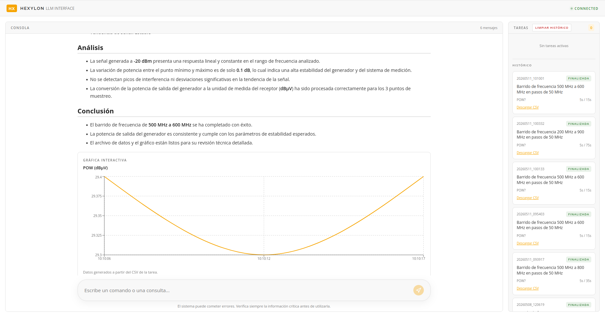

<div align="center">


# Hexylon LLM Client

**Control de equipos RF mediante lenguaje natural**

[](https://www.python.org/)
[](https://fastapi.tiangolo.com/)
[](https://react.dev/)
[](https://ollama.com/)
[](https://en.wikipedia.org/wiki/Standard_Commands_for_Programmable_Instruments)
[](https://github.com/pabloseijo/Hexylon-LLM-Client)

*Desarrollado en colaboración con [Gsertel](https://www.gsertel.com)*

</div>

---

## Descripción

Hexylon LLM Client es un sistema de control inteligente para equipos de medición RF que permite operar el **medidor Hexylon (Gsertel)** y el **generador R&S SGU100A** mediante lenguaje natural, sin necesidad de conocer la sintaxis SCPI.

El sistema combina un pipeline LLM local con un orquestador multi-equipo, tareas asíncronas, barridos de frecuencia automáticos y una interfaz web en tiempo real.

```
Usuario  →  LLM Pipeline  →  Orquestador  →  MCP  →  Hexylon (SCPI)
                                          →  TCP Socket  →  R&S SGU100A (SCPI)
```

---

## Interfaz



*Barrido de frecuencias 500–600 MHz con análisis automático y gráfica interactiva*

---

## Capacidades

| Capacidad | Ejemplo de prompt |
|-----------|-------------------|
| 📡 Comandos SCPI | `"dame la potencia actual"` |
| ⚡ Control del generador | `"pon el generador a -10 dBm y 600 MHz"` |
| 🔗 Secuencias multi-equipo | `"pon el generador a -10 dBm y mide la potencia en hexylon_a cada 5s durante 2 min"` |
| 📈 Barrido de frecuencias | `"barre el generador de 500 MHz a 800 MHz en pasos de 50 MHz y mide la potencia"` |
| ⏱️ Tareas periódicas | `"mide MER y POW cada 10s durante 2 minutos y avísame si MER baja de 20 dB"` |
| 📊 Análisis y gráficas | `"grafícame la última tarea"` |
| 📚 Consultas documentales | `"qué hace POW?"`, `"qué devuelve SOURce:FREQuency:CW"` |
| 🌐 Multiidioma | Español · Gallego · Inglés |

---

## Arquitectura

```
┌─────────────────────────────────────────────────────────┐
│                    Usuario / Frontend                    │
└───────────────────────────┬─────────────────────────────┘
                            │ POST /chat · WS /ws
┌───────────────────────────▼─────────────────────────────┐
│                  FastAPI Backend                         │
└───────────────────────────┬─────────────────────────────┘
                            │
┌───────────────────────────▼─────────────────────────────┐
│                    pipeline.py                           │
│              parse_input() → intent                      │
└──┬──────────┬──────────┬──────────┬──────────┬──────────┘
   │          │          │          │          │
   ▼          ▼          ▼          ▼          ▼
command   knowledge  launch_task  orchestrated  analysis
handler   handler    handler      _sequence     handler
   │                    │              │
   ▼                    ▼              ▼
scpi_generator      task_executor  orchestrator.py
   │                    │          ┌──┴──────────┐
   ▼                    ▼          ▼             ▼
MCP client          CSV Writer  CommandStep   SweepStep
   │                             generator    generator
   ▼                             client.py  + mcp_client
Hexylon                          │             │
(TCP 8814)                       ▼             ▼
                              SGU100A       Hexylon
                              (TCP 5025)  (TCP 8814)
```

### Equipos soportados

| Equipo | Fabricante | Protocolo | Puerto | Cliente |
|--------|-----------|-----------|--------|---------|
| Hexylon | Gsertel | MCP / HTTP | 8814 | `mcp_client.py` |
| SGU100A | Rohde & Schwarz | SCPI TCP Socket | 5025 | `generator_client.py` |

---

## Requisitos

- Python **3.10.12**
- Node.js ≥ 18 + npm
- [Ollama](https://ollama.com/) con modelo `qwen3.5:9b`
- Acceso de red al Hexylon (MCP en puerto 8814)
- Acceso de red al R&S SGU100A (SCPI en puerto 5025)

---

## Instalación

```bash
git clone https://github.com/pabloseijo/Hexylon-LLM-Client
cd Hexylon-LLM-Client
pip install -r requirements.txt
cd ui && npm install && cd ..
```

---

## Configuración

### Variables de entorno

| Variable | Por defecto | Descripción |
|----------|-------------|-------------|
| `OLLAMA_URL` | `http://10.115.0.71:11434/api/chat` | Servidor Ollama |
| `OLLAMA_MODEL` | `qwen3.5:9b` | Modelo LLM |
| `MCP_URL` | `http://10.113.0.148:8814/mcp` | MCP del Hexylon |

### Máquinas (`config/machines.json`)

```json
{
  "hexylon_a": { "url": "http://10.113.0.148:8814/mcp", "type": "hexylon" },
  "hexylon_b": { "url": "http://10.113.0.149:8814/mcp", "type": "hexylon" },
  "generator":  { "url": "http://10.113.100.10",         "type": "generator" },
  "default": "hexylon_a"
}
```

Para añadir un nuevo equipo basta con añadir una entrada en este fichero.

---

## Ejecución

### Backend + frontend

```bash
./scripts/run.sh
```

| Servicio | URL |
|----------|-----|
| Frontend | http://127.0.0.1:5173 |
| Backend API | http://127.0.0.1:8001 |
| Documentación API | http://127.0.0.1:8001/docs |

### Solo backend

```bash
PYTHONPATH=src uvicorn src.api.server:app --reload --port 8001
```

### Chat CLI

```bash
PYTHONPATH=src python3 scripts/chat_pipeline.py
```

### Tests

```bash
PYTHONPATH=src pytest
```

---

## API REST

| Método | Ruta | Descripción |
|--------|------|-------------|
| `POST` | `/chat` | Envía un mensaje al pipeline |
| `GET` | `/tasks` | Lista las tareas activas |
| `DELETE` | `/tasks/{task_id}` | Cancela una tarea |
| `GET` | `/tasks/history` | Historial persistente |
| `GET` | `/download?file=...` | Descarga un CSV |
| `GET` | `/health` | Healthcheck |
| `WS` | `/ws` | Eventos en tiempo real |

### Eventos WebSocket

| Evento | Descripción |
|--------|-------------|
| `task_created` | Nueva tarea lanzada |
| `task_completed` | Tarea finalizada |
| `task_cancelled` | Tarea cancelada |
| `task_failed` | Tarea fallida |
| `task_alert` | Condición de alerta disparada |

---

## Rangos del R&S SGU100A

| Parámetro | Rango | Incremento |
|-----------|-------|------------|
| Frecuencia | 10 MHz – 40 GHz | 1 mHz |
| Potencia | −120 dBm – +25 dBm | 0.01 dBm |

```scpi
FREQ 500 MHz          → Configura frecuencia
POW -10dBm            → Configura potencia
OUTPut:STATe ON       → Activa salida RF
SETTings:APPLy        → Aplica configuración
*IDN?                 → Identificación
```

---

## Estructura del proyecto

```
Hexylon-LLM-Client/
├── config/
│   └── machines.json                    # IPs y tipos de equipos
├── src/
│   ├── api/
│   │   ├── server.py                    # FastAPI — REST + WebSocket
│   │   ├── task_notifier.py             # Puente tareas ↔ WebSocket
│   │   └── task_presenter.py            # Serialización de tareas
│   └── llm/
│       ├── clients/
│       │   ├── mcp_client.py            # Cliente MCP → Hexylon
│       │   ├── generator_client.py      # Cliente SCPI TCP → SGU100A
│       │   └── ollama_client.py         # Cliente HTTP → Ollama
│       ├── core/
│       │   ├── pipeline.py              # Orquestador principal
│       │   ├── scpi_generator.py        # Generación de comandos SCPI
│       │   └── scpi_normalizer.py       # Validación SCPI
│       ├── handlers/
│       │   ├── command_handler.py       # Comandos SCPI directos
│       │   ├── knowledge_handler.py     # Consultas documentales
│       │   ├── task_handler.py          # Ciclo de vida de tareas
│       │   ├── orchestrator_handler.py  # Secuencias y sweeps
│       │   ├── analysis_handler.py      # Análisis de CSV
│       │   └── session_handler.py       # Estado de sesión
│       ├── knowledge/
│       │   ├── command_catalog.py           # Comandos Hexylon
│       │   ├── generator_command_catalog.py # Comandos SGU100A
│       │   ├── topic_catalog.py             # Topics documentales
│       │   ├── query_classifier.py          # Clasificación de consultas
│       │   └── context_builder.py           # Contexto dinámico para LLM
│       ├── memory/
│       │   ├── session_memory.py        # Estado operativo inmediato
│       │   ├── task_history.py          # Historial persistente (JSONL)
│       │   └── conversation_history.py  # Historial conversacional
│       ├── parsing/
│       │   └── main_parser.py           # Parser de intención del usuario
│       └── tasks/
│           ├── task_planner.py          # LLM → TaskPlan estructurado
│           ├── task_executor.py         # Ejecución asíncrona de tareas
│           ├── sweep_executor.py        # Barridos de frecuencia
│           ├── orchestrator.py          # Orquestador multi-máquina
│           ├── task_analyzer.py         # Análisis estadístico
│           └── task_plotter.py          # Generación de gráficos
├── ui/                                  # Frontend React + Vite
├── deploy/                              # Paquetes de despliegue en Hexylon
│   └── hexylon-mcp/
│       └── guia.md                      # Guía de despliegue del servidor MCP
├── tmp/
│   ├── orchestrator.log                 # Log de secuencias con timestamps
│   └── generator.log                    # Log de comandos al generador
├── output/                              # CSVs y gráficos generados
├── scripts/
│   ├── run.sh                           # Arranca backend + frontend
│   └── deploy_hexylon.sh                # Despliega MCP en el Hexylon
├── requirements.txt
└── pytest.ini
```

---

## Validación de secuencialidad

Los logs en `tmp/` permiten verificar que la ejecución es siempre secuencial:

```log
[2026-05-08 11:13:59.224] step=1 machine=generator  command='POW -10dBm'        status=STARTED
[2026-05-08 11:13:59.225] step=1 machine=generator  command='POW -10dBm'        status=OK
[2026-05-08 11:13:59.233] step=2 machine=hexylon_a  task='task_20260508_111359' status=LAUNCHED
```

El paso 2 arranca **8 ms** después de que el paso 1 confirma OK.

---

## Principios de diseño

- **Separación estricta** — MCP sin lógica, LLM solo donde aporta valor, ejecución determinista
- **Control del LLM** — outputs validados, prompts restrictivos, contexto mínimo necesario
- **Multi-equipo extensible** — añadir un nuevo equipo es editar `machines.json` y crear un cliente
- **Observabilidad** — logs con timestamps para validar secuencialidad y depurar errores
- **Sin bloqueos** — tareas y sweeps ejecutados en background, chat siempre disponible

---

<div align="center">

Desarrollado por **Pablo Seijo** · Gsertel · 2026

</div>