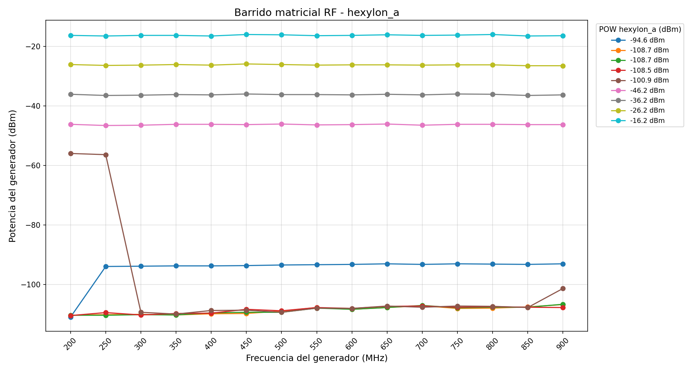

# Caso de uso: Barrido matricial frecuencia/potencia con cliente LLM

## 1. Descripción general

Este caso de uso documenta la ejecución de un barrido matricial frecuencia/potencia sobre un equipo de medida Hexylon (GSERTEL) controlado mediante un cliente LLM. El sistema automatiza la configuración del generador RF R&S SGU100A y la adquisición de medidas en el receptor Hexylon, generando resultados en CSV y gráficas automáticas.

---

## 2. Topología del sistema

```
Cliente LLM (chat)
        ↓
   Orchestrator
        ↓
┌───────────────────────┐
│  Generador R&S SGU100A │
│  TCP socket :5025      │
└───────────────────────┘
        ↓ RF
┌───────────────────────┐
│  hexylon_a             │
│  Receptor RF           │
└───────────────────────┘
```

- **Protocolo de control Hexylon:** SCPI sobre TCP puerto 5025
- **Protocolo de control generador:** SCPI sobre TCP puerto 5025
- **Interfaz de usuario:** chat LLM en lenguaje natural

---

## 3. Stack tecnológico

| Componente | Tecnología |
|---|---|
| Backend | Python |
| Control Hexylon | MCP (Model Context Protocol) |
| Control generador | Socket TCP directo |
| Frontend | React + TypeScript |
| Gráficas | Recharts |
| Progreso en tiempo real | WebSocket |
| Persistencia | CSV |

---

## 4. Prompt de usuario para lanzar el barrido

El usuario introduce en el chat el siguiente prompt en lenguaje natural:

```
Barrido matricial frecuencia/potencia: 700-900 MHz paso 50 MHz;
-10 a -40 dBm paso -10 dB; equipos hexylon_a
```

El cliente LLM interpreta este prompt y lanza automáticamente un `MatrixSweepExecutor` con los parámetros extraídos:

| Parámetro | Valor |
|---|---|
| Frecuencia inicio | 700 MHz |
| Frecuencia fin | 900 MHz |
| Paso de frecuencia | 50 MHz |
| Potencia inicio | -10 dBm |
| Potencia fin | -40 dBm |
| Paso de potencia | -10 dBm |
| Equipos receptores | hexylon_a |
| Comandos de medida | `FREQ?`, `POW?` |

**Total de puntos del barrido:** 5 frecuencias × 4 niveles de potencia = 20 puntos.

---

## 5. Sincronización de frecuencia — offset de canal

El plan de canales del Hexylon (TERRA DEFAULT) tiene los canales centrados 2.75 MHz por debajo de la frecuencia nominal. Cuando el generador emite a 900 MHz, el canal que sintoniza el Hexylon está centrado en 897.25 MHz.

Para compensarlo, el sistema aplica automáticamente el offset antes de enviar el comando `FREQ` al Hexylon:

```
frecuencia_hexylon = frecuencia_generador − 2.75 MHz
```

El generador recibe siempre la frecuencia nominal exacta. Solo el comando enviado al Hexylon lleva el offset aplicado.

---

## 6. Secuencia de ejecución por punto

Para cada combinación (potencia, frecuencia) el sistema ejecuta en orden:

1. `POW <x>dBm` → generador (configura nivel de potencia)
2. `FREQ <f> MHz` → generador (frecuencia nominal)
3. `FREQ <f − 2.75> MHz` → Hexylon (frecuencia con offset aplicado)
4. Espera 1 segundo (estabilización del tuner)
5. `LOCK?` → Hexylon (fuerza actualización interna)
6. Espera 1 segundo adicional
7. `FREQ?` → Hexylon (lectura de frecuencia sintonizada)
8. `POW?` → Hexylon (lectura de potencia recibida)
9. Escritura de fila en CSV y flush
10. Evento WebSocket `matrix_sweep_progress` al frontend

---

## 7. Tolerancia a fallos por equipo

El sistema implementa aislamiento automático de equipos fallidos durante el barrido:

- Si un equipo devuelve error en cualquier comando, queda añadido al conjunto `disabled_machines`.
- Los puntos siguientes del barrido omiten ese equipo con el valor `SKIPPED: equipo deshabilitado por error previo`.
- El resto de equipos continúan midiendo con normalidad.
- Se emite un evento WebSocket `machine_disabled` con la máquina afectada, la razón, la frecuencia y la potencia en el momento del fallo.

---

## 8. Resultados del barrido ejecutado

**Fecha de ejecución:** 2026-05-13 12:19:08

**Resultado:** Barrido completado — 20 puntos adquiridos en hexylon_a.

### 8.1 Parámetros del barrido ejecutado

| Parámetro | Valor |
|---|---|
| Frecuencias | 700, 750, 800, 850, 900 MHz |
| Niveles de potencia | -10, -20, -30, -40 dBm |
| Total de puntos | 20 |
| Duración | 12:19:08 → 12:21:58 (~3 min) |

### 8.2 Resumen de medidas hexylon_a (POW?)

| Potencia generador (dBm) | Media POW medida (dBµV) |
|---|---|
| -10 | 92.46 |
| -20 | 82.46 |
| -30 | 72.44 |
| -40 | 62.48 |

Rango total medido: **62.3 dBµV** a **92.7 dBµV**.

Se observa una correlación lineal perfecta — exactamente 10 dBµV por cada 10 dBm de variación en la potencia del generador, uniforme en todas las frecuencias del barrido. El offset de canal corregido permite medidas consistentes en todo el rango de frecuencias.

### 8.3 Muestra del CSV generado

| timestamp | generator_power_dbm | generator_frequency_mhz | hexylon_a_frequency_set_response | hexylon_a_FREQ? | hexylon_a_POW? |
|---|---|---|---|---|---|
| 2026-05-13 12:19:08 | -10.0 | 700.0 | CMD OK | FREQ 700000 kHz | 92.5 dBµV |
| 2026-05-13 12:19:17 | -10.0 | 750.0 | CMD OK | FREQ 750000 kHz | 92.5 dBµV |
| 2026-05-13 12:19:26 | -10.0 | 800.0 | CMD OK | FREQ 800000 kHz | 92.7 dBµV |
| 2026-05-13 12:19:35 | -10.0 | 850.0 | CMD OK | FREQ 850000 kHz | 92.3 dBµV |
| 2026-05-13 12:19:44 | -10.0 | 900.0 | CMD OK | FREQ 900000 kHz | 92.3 dBµV |
| 2026-05-13 12:20:37 | -30.0 | 700.0 | CMD OK | FREQ 700000 kHz | 72.2 dBµV |
| 2026-05-13 12:21:22 | -40.0 | 700.0 | CMD OK | FREQ 700000 kHz | 62.3 dBµV |
| 2026-05-13 12:21:58 | -40.0 | 900.0 | CMD OK | FREQ 900000 kHz | 62.5 dBµV |

---

## 9. Prompt de usuario para graficar los resultados

Una vez completado el barrido, el usuario introduce en el chat:

```
Grafica los resultados del último barrido matricial. Usa el CSV generado.
Para el hexylon_a, convierte las medidas de POW? de dBµV a dBm restando
108.75 dB (sistema 75 Ω). Representa en el eje X la frecuencia del generador
en MHz, en el eje Y la potencia medida en hexylon_a en dBm, y pinta una línea
por cada nivel de potencia del generador. Cada línea tiene 15 puntos,
uno por cada frecuencia del barrido.
```

### Descripción de la gráfica generada

| Elemento | Valor |
|---|---|
| Eje X | Frecuencia del generador (MHz) |
| Eje Y | Potencia medida por hexylon_a (dBm) |
| Líneas | Una por cada nivel de potencia del generador: -10, -20, -30, -40 dBm (4 líneas) |
| Puntos por línea | 5 (uno por cada frecuencia del barrido) |
| Conversión | dBm = dBµV − 108.75 (sistema 75 Ω) |
| Receptor | hexylon_a |

### Gráfica resultante



Las 4 líneas son perfectamente paralelas y planas a lo largo de todas las frecuencias, con una separación constante de 10 dBm entre cada nivel de potencia del generador. Esto confirma el correcto funcionamiento del sistema de medida con el offset de canal aplicado.
